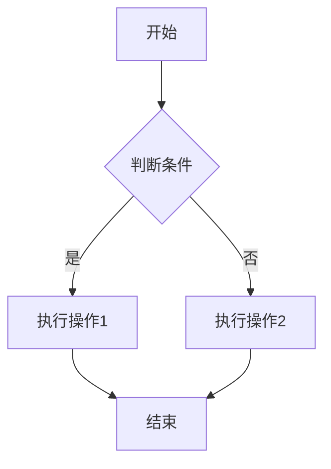
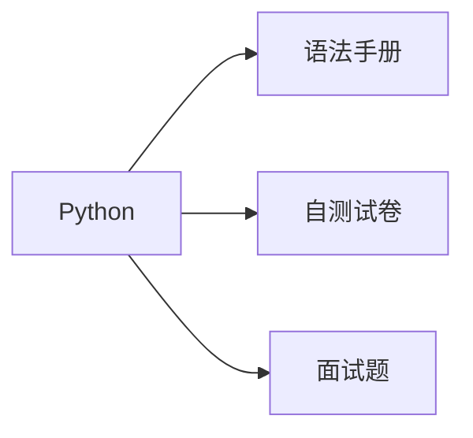

# 功能使用说明

## 1. 代码块行号

所有代码块默认显示行号，无需额外配置：

````markdown
```python
def hello():
    print("Hello, World!")
```
````

## 2. 数学公式（KaTeX）

使用 `$` 表示行内公式，`$$` 表示块级公式：

```markdown
行内公式：$E = mc^2$

块级公式：
$$
\int_{-\infty}^{\infty} e^{-x^2} dx = \sqrt{\pi}
$$
```

**示例：**
- 行内公式：$E = mc^2$
- 块级公式：
$$
\int_{-\infty}^{\infty} e^{-x^2} dx = \sqrt{\pi}
$$

## 3. Mermaid 图表

使用代码块语法，语言标识为 `mermaid`：

````markdown

````

**注意：** Mermaid 图表会在页面加载后自动渲染，支持深色主题。

**支持的图表类型：**
- 流程图（flowchart / graph）
- 序列图（sequenceDiagram）
- 甘特图（gantt）
- 类图（classDiagram）
- 状态图（stateDiagram）
- 饼图（pie）
- 等等...

**示例：**



## 4. 图片点击放大

文档中的所有图片都可以点击放大查看，点击遮罩或按 `ESC` 关闭。

## 5. 阅读进度条

页面顶部会显示阅读进度条，实时反映当前阅读位置。

## 6. 返回顶部按钮

滚动超过 300px 后，右下角会出现返回顶部按钮，点击平滑滚动到顶部。

## 7. 搜索功能

使用顶栏的搜索按钮（或快捷键 `Ctrl+K` / `Cmd+K`）可以全文搜索文档内容。

## 8. 目录自动高亮

滚动页面时，右侧大纲会自动高亮当前阅读的章节，方便定位。

## 9. 平滑滚动

点击锚点链接或目录项时，页面会平滑滚动到目标位置，体验更流畅。

## 10. 代码块折叠

超过 30 行的长代码块会自动显示「展开/折叠」按钮，点击可折叠代码，节省空间。

## 11. 代码块语言标签

每个代码块右上角会显示语言标签（如 `PYTHON`、`JAVASCRIPT`），方便识别。

## 12. 键盘快捷键

- **`Ctrl+K` / `Cmd+K`** - 打开搜索
- **`Ctrl+/` / `Cmd+/`** - 显示快捷键帮助
- **`ESC`** - 关闭弹窗/图片
- **`↑` / `↓`** - 搜索结果导航

## 13. 打印优化

打印文档时，会自动隐藏侧边栏、导航栏等非内容元素，只打印正文内容，适合生成 PDF。

## 14. 移动端优化

- 返回顶部按钮在移动端自动调整大小和位置
- 代码块标签和按钮适配小屏幕
- 触摸友好的交互体验

## 15. 上一篇 / 下一篇

页面底部会显示「上一篇」「下一篇」链接，方便在文档间顺序阅读。

## 16. 全屏阅读模式

顶栏右侧提供全屏阅读按钮（⛶），点击后隐藏左侧侧栏和右侧大纲，内容区域占满可用空间，适合专注阅读。再次点击恢复。偏好会保存在本地。

## 17. 复制成功提示

点击代码块的「复制」按钮后，页面底部会短暂显示「已复制」提示。

## 18. 预估阅读时间

每篇文档标题下方会显示「约 X 分钟阅读」。计算方式：只统计正文段落文字（排除代码块、标题等），按中文阅读速度约 350 字/分钟估算，便于安排阅读时间。

## 19. 页脚

站点页脚会显示简短说明与版权信息，可在 `.vitepress/config.mts` 的 `themeConfig.footer` 中修改。
