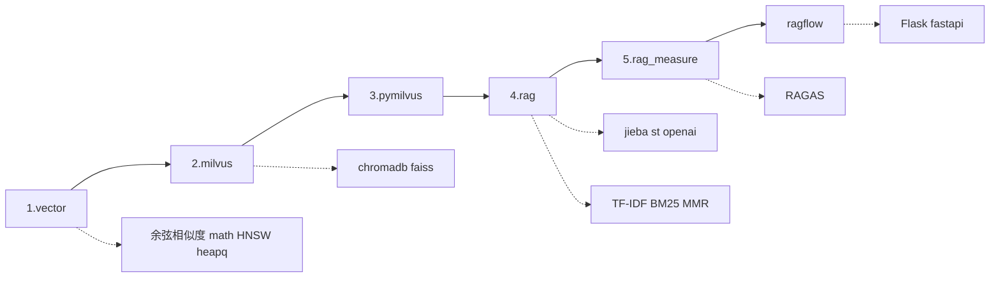
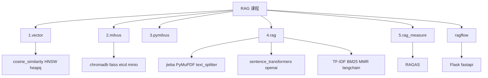
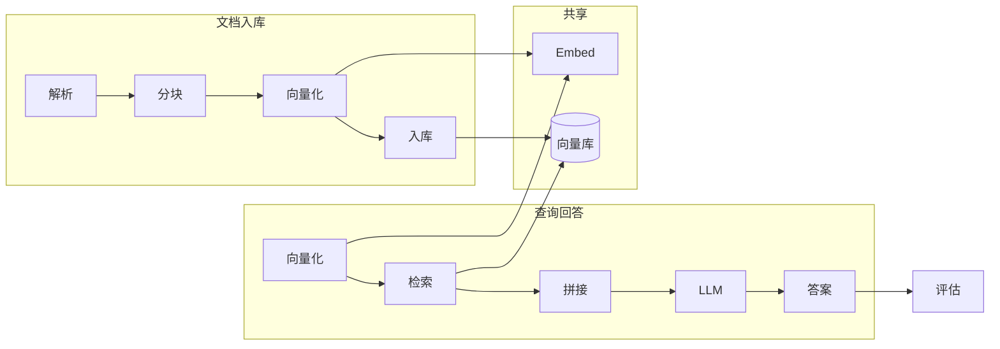

# AI 课程：知识体系与学习路径

本页按 [rag.docs-hub.com](https://rag.docs-hub.com/) 课程目录，用**流程图**和**脑图**把「向量 → 向量库 → RAG → 评估」及全部周边文档串成一条线，方便按体系学、按场景查。

---

## 一、学习路径图（建议顺序）

主线：1.vector → 2.milvus → 3.pymilvus → 4.rag → 5.rag_measure → ragflow；支线详见第四节索引。

---

## 二、概念关系脑图

按 [rag.docs-hub.com](https://rag.docs-hub.com/) 六大模块，每模块下列核心项；完整清单见第四节。

向量与检索下的**余弦相似度**、**HNSW** 等在本站有完整文档，见侧栏或第四节索引。

---

## 三、RAG 流程与技术栈

从「原始文档」到「用户答案」的整条链路；各环节技术栈详见第四节索引。

---

## 四、与 Python 分类的交叉

课程里用到的**标准库与第三方库**文档**统一放在 Python 分类**（不在 AI 下重复放）：标准库总览见 [语法手册第11章](/python/python语法手册-11-标准库)，单篇与第三方库见侧栏「标准库」「第三方库（课程内）」。下表从 AI 侧链到 Python 侧，方便学 RAG 时按需补基础：

| 主题 | 本站文档（均在 Python 分类） | 说明 |
|------|-----------------------------|------|
| 数学库 | [math 数学库](/python/AI课程-math数学库) | 常量、数值、三角函数、幂与对数等 |
| 类型提示 | [typing 类型提示](/python/AI课程-typing类型提示) | List/Dict/Optional/泛型等 |
| 容器扩展 | [collections](/python/AI课程-collections) | Counter、defaultdict、deque 等 |
| 随机数 | [random](/python/AI课程-random) | random()、randint、choice/sample/shuffle、种子与分布等 |
| 堆与优先队列 | [heapq 使用指南](/python/heapq使用指南) · [HNSW](/ai/AI课程-HNSW)（检索中用堆） | 与 HNSW 优先队列搜索衔接 |
| 中文分词 | [jieba](/python/AI课程-jieba) | RAG 文档解析、文本分析常用 |
| HTML/XML 解析 | [BeautifulSoup4](/python/AI课程-beautifulsoup4) | 网页抓取、RAG 文档采集 |

**从 Python 入口找**：打开 [Python 首页](/python/)，侧栏「标准库」「第三方库（课程内）」或首页对应表格可跳转。

---

## 五、完整文档索引（rag.docs-hub.com）

以下为课程全部文档，按类别分组，点击可跳转至 [rag.docs-hub.com](https://rag.docs-hub.com/) 对应页面。

### 主线

| 文档 | 链接 |
|------|------|
| 1.vector | [1.vector](https://rag.docs-hub.com/html/1.vector.html) |
| 2.milvus | [2.milvus](https://rag.docs-hub.com/html/2.milvus.html) |
| 3.pymilvus | [3.pymilvus](https://rag.docs-hub.com/html/3.pymilvus.html) |
| 4.rag | [4.rag](https://rag.docs-hub.com/html/4.rag.html) |
| 5.rag_measure | [5.rag_measure](https://rag.docs-hub.com/html/5.rag_measure.html) |
| ragflow | [ragflow](https://rag.docs-hub.com/html/ragflow.html) |

### 向量与检索

| 文档 | 链接 |
|------|------|
| **余弦相似度**（本地） | [余弦相似度](/ai/AI课程-余弦相似度) |
| cosine_similarity（课程） | [cosine_similarity](https://rag.docs-hub.com/html/cosine_similarity.html) |
| HNSW | [HNSW](https://rag.docs-hub.com/html/HNSW.html) · [本地](/ai/AI课程-HNSW) |
| heapq | [heapq](https://rag.docs-hub.com/html/heapq.html) · [heapq 使用指南](/python/heapq使用指南) |
| **math 数学库**（本地） | [math 数学库](/python/AI课程-math数学库) |
| math（课程） | [math](https://rag.docs-hub.com/html/math.html) |
| numpy | [numpy](https://rag.docs-hub.com/html/numpy.html) |

### 向量库与存储

| 文档 | 链接 |
|------|------|
| **etcd**（本地） | [etcd](/ai/AI课程-etcd) |
| etcd（课程） | [etcd](https://rag.docs-hub.com/html/etcd.html) |
| **chromadb**（本地） | [ChromaDB](/ai/AI课程-chromadb) |
| chromadb（课程） | [chromadb](https://rag.docs-hub.com/html/chromadb.html) |
| faiss | [faiss](https://rag.docs-hub.com/html/faiss.html) |
| **MinIO**（本地） | [MinIO](/ai/AI课程-minio) |
| minio（课程） | [minio](https://rag.docs-hub.com/html/minio.html) |

### 文档解析与处理

| 文档 | 链接 |
|------|------|
| **jieba**（本地） | [jieba](/python/AI课程-jieba) |
| jieba（课程） | [jieba](https://rag.docs-hub.com/html/jieba.html) |
| **beautifulsoup4**（本地） | [BeautifulSoup4](/python/AI课程-beautifulsoup4) |
| beautifulsoup4（课程） | [beautifulsoup4](https://rag.docs-hub.com/html/beautifulsoup4.html) |
| PyMuPDF | [PyMuPDF](https://rag.docs-hub.com/html/PyMuPDF.html) |
| python-docx | [python-docx](https://rag.docs-hub.com/html/python-docx.html) |
| python-pptx | [python-pptx](https://rag.docs-hub.com/html/python-pptx.html) |
| openpyxl | [openpyxl](https://rag.docs-hub.com/html/openpyxl.html) |
| lxml | [lxml](https://rag.docs-hub.com/html/lxml.html) |
| text_splitter | [text_splitter](https://rag.docs-hub.com/html/text_splitter.html) |
| requests | [requests](https://rag.docs-hub.com/html/requests.html) |

### 嵌入与模型

| 文档 | 链接 |
|------|------|
| **Sentence Transformers**（本地） | [Sentence Transformers](/ai/AI课程-sentence_transformers) |
| sentence_transformers（课程） | [sentence_transformers](https://rag.docs-hub.com/html/sentence_transformers.html) |
| all-MiniLM-L6-v2 | [all-MiniLM-L6-v2](https://rag.docs-hub.com/html/all-MiniLM-L6-v2.html) |
| BPETokenizer | [BPETokenizer](https://rag.docs-hub.com/html/BPETokenizer.html) |
| openai | [openai](https://rag.docs-hub.com/html/openai.html) |
| llm | [llm](https://rag.docs-hub.com/html/llm.html) |

### 检索与排序算法

| 文档 | 链接 |
|------|------|
| TF-IDF | [TF-IDF](https://rag.docs-hub.com/html/TF-IDF.html) |
| rank_bm25 | [rank_bm25](https://rag.docs-hub.com/html/rank_bm25.html) |
| MMR | [MMR](https://rag.docs-hub.com/html/MMR.html) |
| RRF | [RRF](https://rag.docs-hub.com/html/RRF.html) |
| BagofWords | [BagofWords](https://rag.docs-hub.com/html/BagofWords.html) |
| CrossEncoder | [CrossEncoder](https://rag.docs-hub.com/html/CrossEncoder.html) |

### 评估与框架

| 文档 | 链接 |
|------|------|
| RAGAS | [RAGAS](https://rag.docs-hub.com/html/RAGAS.html) |
| langchain | [langchain](https://rag.docs-hub.com/html/langchain.html) |
| PromptEngineering | [PromptEngineering](https://rag.docs-hub.com/html/PromptEngineering.html) |
| Jinja2 | [Jinja2](https://rag.docs-hub.com/html/Jinja2.html) |
| Lost-in-the-middle | [Lost-in-the-middle](https://rag.docs-hub.com/html/Lost-in-the-middle.html) |

### Web 与部署

| 文档 | 链接 |
|------|------|
| Flask | [Flask](https://rag.docs-hub.com/html/Flask.html) |
| fastapi | [fastapi](https://rag.docs-hub.com/html/fastapi.html) |
| Starlette | [Starlette](https://rag.docs-hub.com/html/Starlette.html) |
| uvicorn | [uvicorn](https://rag.docs-hub.com/html/uvicorn.html) |

### Python 与工具

| 文档 | 链接 |
|------|------|
| **typing 类型提示**（本地） | [typing 类型提示](/python/AI课程-typing类型提示) |
| typing（课程） | [typing](https://rag.docs-hub.com/html/typing.html) |
| **collections**（本地） | [collections](/python/AI课程-collections) |
| collections（课程） | [collections](https://rag.docs-hub.com/html/collections.html) |
| **random**（本地） | [random](/python/AI课程-random) |
| random（课程） | [random](https://rag.docs-hub.com/html/random.html) |
| abc | [abc](https://rag.docs-hub.com/html/abc.html) |
| dataclasses | [dataclasses](https://rag.docs-hub.com/html/dataclasses.html) |
| Generic | [Generic](https://rag.docs-hub.com/html/Generic.html) |
| argparse | [argparse](https://rag.docs-hub.com/html/argparse.html) |
| Pydantic | [Pydantic](https://rag.docs-hub.com/html/Pydantic.html) |
| Runnable | [Runnable](https://rag.docs-hub.com/html/Runnable.html) |
| asyncio | [asyncio](https://rag.docs-hub.com/html/asyncio.html) |
| concurrent | [concurrent](https://rag.docs-hub.com/html/concurrent.html) |
| sqlalchemy | [sqlalchemy](https://rag.docs-hub.com/html/sqlalchemy.html) |
| python-dotenv | [python-dotenv](https://rag.docs-hub.com/html/python-dotenv.html) |
| ssl | [ssl](https://rag.docs-hub.com/html/ssl.html) |
| urllib | [urllib](https://rag.docs-hub.com/html/urllib.html) |
| scikit-learn | [scikit-learn](https://rag.docs-hub.com/html/scikit-learn.html) |
| LaTeX | [LaTeX](https://rag.docs-hub.com/html/LaTeX.html) |
| logger | [logger](https://rag.docs-hub.com/html/logger.html) |
| io | [io](https://rag.docs-hub.com/html/io.html) |
| venv | [venv](https://rag.docs-hub.com/html/venv.html) |
| parameter | [parameter](https://rag.docs-hub.com/html/parameter.html) |
| SSE | [SSE](https://rag.docs-hub.com/html/SSE.html) |

---

## 六、小结

- **先走主线**：1.vector → 2.milvus → 3.pymilvus → 4.rag → 5.rag_measure → ragflow。  
- **概念不清时**：看第二节脑图，把「向量 / 向量库 / RAG / 评估 / 落地」对上号。  
- **要做某一步时**：看第三节 RAG 流程图，查对应技术栈；从第四节「完整文档索引」跳转。向量与检索中的**余弦相似度**、**HNSW** 等在本站有详文，适合新手按顺序阅读。

建议把本页加入书签，作为整个 RAG 课程的地图使用。全站（Python、AI、Linux、Docker）总览见 [学习路径总览](/学习路径总览)。
