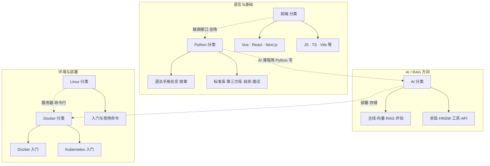

# 全站学习路径总览

本站文档分为 **Python**、**AI**、**Linux**、**Docker**、**前端** 五大类。本页用一张总图 + **前端转全栈路径** + 各分类入口与建议顺序，帮你从零串起整条学习线，按目标选路、按分类深挖。

> **若你是前端开发、没接触过后端与 Linux/Docker、想转型全栈**：可直接看下方 [**二、前端转全栈：建议路径**](#二前端转全栈建议路径)。该路径按「可验证成果」分阶段设计，并补充了课程外常缺的一环（数据库、认证、HTTP 意识等），顺序与理由见各阶段说明。

---

## 一、全站结构总图

- **Python**：语法手册（含第11章标准库）、标准库与第三方库（课程内单篇）、自测与面试均在此分类。  
- **前端**：Vue、React、Next.js、JavaScript、TypeScript、Vite 等（当前为占位，文档待补充）。  
- **AI**：向量、RAG、评估、模型与 API；课程用到的标准库与第三方库在 [Python 分类](/python/) 的侧栏「标准库」「第三方库（课程内）」中，可从 [知识体系](/ai/知识体系与学习路径#四、与-python-分类的交叉) 跳转。  
- **Linux**：命令行与操作基础，跑服务、看日志、排查环境时常用。  
- **Docker**：容器与编排（含 K8s），部署 AI 服务、etcd、MinIO 等会用到。

---

## 二、前端转全栈：建议路径

下面这条路径面向**只会前端、未接触后端与运维**的同学，按「每一步都有可验证成果」来设计阶段，并补上课程之外全栈常缺的一环（数据库、认证、HTTP 意识等）。顺序的考虑是：先在本机跑通「前后端联调」→ 再学在服务器上跑起来（Linux）→ 再用容器固化环境（Docker）→ 再补数据与身份（数据库、认证）→ 最后按兴趣选深入方向。

---

### 为什么是这个顺序？

- **先接口、后环境、再容器**：若先学 Linux/Docker，你还没有「要部署的东西」，容易空转。先写出一个能被前端调用的 API，再学「把它放到服务器、放进容器」，每一步都有明确目标。
- **Linux 在 Docker 前**：真实后端跑在服务器上，日志、进程、排错都在 Linux 里；不会基本命令行，上线后排查会很痛苦。先会 SSH、看日志、查进程，再用 Docker 封装，更稳。
- **数据库和认证放在「能部署」之后**：先会写无状态接口并部署，再加「存数据、认用户」，复杂度拆开，避免一次堆太多概念。

---

### 阶段一：后端语言与 API（在本机跑通前后端联调）

**目标**：用 Python 写几个接口（GET/POST），前端用 fetch/axios 能调通、拿到 JSON；理解请求体、响应体、状态码。

**建议顺序**：

1. **Python 语法**：变量、函数、类、异常、字典/列表即可；可跳读 [语法手册总览](/python/python语法手册)，第 11 章标准库扫一眼。
2. **第一个 HTTP 接口**：用 [Flask](/python/AI课程-Flask) 写一个返回 JSON 的 GET，再写一个接收 JSON body 的 POST；在本机用浏览器或 Postman 测，再用前端页面调。
3. **请求体验证**：用 [Pydantic](/python/AI课程-Pydantic) 校验 POST body（类型、必填、范围），和你在前端的 TS 类型/校验思维一致。
4. **联调时注意**：跨域（CORS）、Content-Type（application/json）、错误时返回合适状态码（400/404/500），这些是「前端转全栈」最容易忽略的后端意识。

**本站入口**：[Python 首页](/python/) → [语法手册总览](/python/python语法手册) → [Flask](/python/AI课程-Flask) → [Pydantic](/python/AI课程-Pydantic)。

**阶段成果**：本机有一个小前端 + 一个 Flask 后端，前端能提交表单或请求数据，后端校验并返回 JSON。

---

### 阶段二：命令行与运行环境（能在服务器上操作）

**目标**：能 SSH 登录服务器，会基本目录与文件操作、看日志、查进程与端口，能改简单配置；理解「后端是跑在别人机器上的进程」。

**建议顺序**：

1. **基础命令**：目录与文件（cd/ls/cat/mkdir/touch）、权限（chmod/chown）、进程（ps/top）、网络与端口（如 ss 或 netstat）。
2. **日志与排错**：tail、grep、重定向；能快速定位「服务为什么挂了、报错在哪一行」。
3. **简单运维意识**：环境变量、后台运行（nohup/systemd 可后续再学）、防火墙与端口开放。

**本站入口**：[Linux 入门与常用命令手册](/linux/Linux入门与常用命令手册)。

**阶段成果**：能在云服务器或本机虚拟机里，把阶段一的 Flask 跑起来，并从本机浏览器访问该服务器上的接口。

---

### 阶段三：容器与部署（环境一致、可迁移）

**目标**：把阶段一的后端打成镜像、用 Docker 跑起来，理解「镜像 = 环境 + 代码」，避免「在我机器上能跑」。

**建议顺序**：

1. **Docker 基础**：镜像、容器、`docker build` 与 `docker run`；把 Flask 应用写进 Dockerfile，本地跑通。
2. **多容器与编排**：需要 DB/Redis 等时用 `docker-compose` 把多个服务串起来；上云或要弹性时再学 [Kubernetes 入门](/docker/Kubernetes入门)。

**本站入口**：[Docker 入门与常用命令手册](/docker/Docker入门与常用命令手册) → [Kubernetes 入门](/docker/Kubernetes入门)（按需）。

**阶段成果**：同一份 Dockerfile/docker-compose 在本机与服务器上都能跑，部署流程可复现。

---

### 阶段四：数据持久化与身份（完整全栈的缺口）

**目标**：接口背后有真实数据存储；能区分「谁在访问」（认证）和「能访问什么」（权限）。这是课程文档涉及较少、但做产品必备的一环。

**建议顺序**：

1. **数据库**：先会用一种关系型 DB（如 SQLite 或 PostgreSQL）做增删改查与简单表设计；再考虑 ORM（如 SQLAlchemy）减少手写 SQL。本站以 AI 课程为主，DB 可结合 [语法手册第 11 章](/python/python语法手册-11-标准库) 与外部教程。
2. **认证与授权**：登录态（Session 或 JWT）、鉴权中间件、简单角色（如未登录/普通用户/管理员）；先做「能登录、能区分用户」，再细化权限模型。
3. **HTTP 与安全意识**：HTTPS、不在 URL 里传敏感参数、敏感信息不写前端；错误信息不向用户暴露内部细节。

**本站入口**：数据库与认证暂无独立课程文档，可依托 [Python 首页](/python/) 的第三方库与标准库，配合外部资料；部署与运行环境仍用 [Linux](/linux/Linux入门与常用命令手册)、[Docker](/docker/Docker入门与常用命令手册)。

**阶段成果**：一个小型「带登录 + 读写数据库」的完整应用，能部署在服务器或容器中。

---

### 阶段五：按方向深入（全栈巩固 或 转 AI/运维）

**目标**：在「能写接口、能部署、能存数据、能认用户」的基础上，按兴趣选方向深化。

- **继续全栈**：接口设计（REST/风格统一）、错误处理与日志规范、简单自动化测试（如 pytest 测接口）、CI/CD 入门；可结合本站 [标准库](/python/python语法手册-11-标准库) 与 [第三方库](/python/) 查漏。
- **走 AI / RAG**：用同一套 Python 与部署能力，学 [知识体系与学习路径](/ai/知识体系与学习路径) → [RAG 与向量基础](/ai/AI课程-RAG与向量基础) → 主线课程；RAG 服务本身也是「一个 API + 向量库 + 模型调用」，和现有后端思维一致。
- **偏运维/云**：K8s、监控与告警、日志聚合；本站 [Kubernetes 入门](/docker/Kubernetes入门)、[etcd](/ai/AI课程-etcd)、[MinIO](/ai/AI课程-minio) 等可作扩展阅读。

---

### 节奏与心态建议

- **每阶段一个小成果**：阶段一「本机联调成功」、阶段二「服务器上能访问」、阶段三「Docker 一键跑起」、阶段四「带登录和数据库的小项目」，再进入下一阶段，比一次啃完所有概念更稳。
- **不必等「学完」再动手**：边做小项目边补文档和教程，遇到不会的再查本站或外部资料，迭代式学习更容易坚持。

---

## 三、按分类看：入口与建议顺序

### 3.1 Python 分类

| 目标 | 建议顺序 | 入口与文档 |
|------|----------|------------|
| 打牢语法与查漏补缺 | 语法手册总览 → 自测试卷 → 面试题 | [Python 首页](/python/) · [语法手册总览](/python/python语法手册) |
| 堆、优先队列、Top-K | heapq 使用指南 | [heapq 使用指南](/python/heapq使用指南) |
| 标准库 | 第11章总览 + math、typing、collections、random、abc、dataclasses、heapq | [Python 首页](/python/)「标准库」表 |
| 第三方库（课程内） | jieba、BeautifulSoup4、lxml、OpenPyXL、PyMuPDF、**Pydantic**、python-docx、python-pptx、Requests、text_splitter、Sentence Transformers、OpenAI、Flask、NumPy、**Scikit-learn**、LaTeX | [Python 首页](/python/)「第三方库（课程内）」表 |

**分类首页**：[Python](/python/)

---

### 3.2 AI 分类

| 目标 | 建议顺序 | 入口与文档 |
|------|----------|------------|
| 从零建整体地图 | 知识体系与学习路径 | [知识体系与学习路径](/ai/知识体系与学习路径) |
| 主线：向量 → RAG → 评估 | RAG 与向量基础 → Milvus → RAG 检索增强 → RAG 评估 → RAGFlow | [AI 首页](/ai/) 课程总览表 |
| 支线：标准库与第三方库 | 第11章、math/typing/collections/random/abc/dataclasses/heapq、jieba、BeautifulSoup4、lxml、OpenPyXL、PyMuPDF、Pydantic、python-docx、python-pptx、Requests、text_splitter、Sentence Transformers、OpenAI、NumPy、Scikit-learn、LaTeX | 见 [知识体系与学习路径](/ai/知识体系与学习路径) 与 [Python 交叉表](/ai/知识体系与学习路径#四、与-python-分类的交叉) |
| 向量与检索深入 | 余弦相似度、HNSW、ChromaDB、FAISS、heapq | [余弦相似度](/ai/AI课程-余弦相似度) · [HNSW](/ai/AI课程-HNSW) · [ChromaDB](/ai/AI课程-chromadb) · [FAISS](/ai/AI课程-faiss) · [heapq 使用指南](/python/heapq使用指南) |
| 基础设施与部署 | etcd、MinIO、K8s | [etcd](/ai/AI课程-etcd) · [MinIO](/ai/AI课程-minio) · [Kubernetes 入门](/docker/Kubernetes入门) |

**分类首页**：[AI](/ai/)

---

### 3.3 Linux 分类

| 目标 | 建议顺序 | 入口与文档 |
|------|----------|------------|
| 零基础上手命令行 | Linux 入门与常用命令手册 | [Linux 入门与常用命令手册](/linux/Linux入门与常用命令手册) |

**分类首页**：[Linux](/linux/)

---

### 3.4 Docker 分类

| 目标 | 建议顺序 | 入口与文档 |
|------|----------|------------|
| 容器从零到会用 | Docker 入门与常用命令手册 | [Docker 入门与常用命令手册](/docker/Docker入门与常用命令手册) |
| 多容器编排、部署 AI/服务 | Kubernetes 入门 | [Kubernetes 入门](/docker/Kubernetes入门) |

**分类首页**：[Docker](/docker/)

---

### 3.5 前端分类

| 目标 | 说明 | 入口与文档 |
|------|------|------------|
| 前端技术栈（占位） | Vue、React、Next.js、JavaScript、TypeScript、Vite 等，具体文档待补充 | [前端 首页](/frontend/) |

**分类首页**：[前端](/frontend/)

---

## 四、按目标选路（我想…）

| 我想… | 建议路径 |
|--------|----------|
| **前端转全栈（不会后端 / Linux / Docker）** | 见上方 [**二、前端转全栈：建议路径**](#二前端转全栈建议路径)：五阶段为「接口联调 → Linux 环境 → Docker 部署 → 数据库与认证 → 按方向深入」；每阶段有目标与本站入口。 |
| **补前端（Vue / React / TS / Vite 等）** | [前端 首页](/frontend/)（当前为占位，文档待补充）。 |
| 先把 Python 语法和常用库搞熟 | [Python 首页](/python/) → [语法手册总览](/python/python语法手册) → [heapq 使用指南](/python/heapq使用指南)，再按需看 [math 数学库](/python/AI课程-math数学库)、[typing 类型提示](/python/AI课程-typing类型提示)、[collections](/python/AI课程-collections) |
| 从零学 RAG / 向量 / AI 应用 | [知识体系与学习路径](/ai/知识体系与学习路径) → [RAG 与向量基础](/ai/AI课程-RAG与向量基础) → Milvus → RAG 检索增强 → 评估 → RAGFlow；需要时补 [余弦相似度](/ai/AI课程-余弦相似度)、[FAISS](/ai/AI课程-faiss)、[ChromaDB](/ai/AI课程-chromadb)、[提示词工程](/ai/AI课程-PromptEngineering)、[math 数学库](/python/AI课程-math数学库) |
| 在服务器上跑服务、用命令行 | [Linux 入门与常用命令手册](/linux/Linux入门与常用命令手册) |
| 用容器跑应用、以后上 K8s | [Docker 入门](/docker/Docker入门与常用命令手册) → [Kubernetes 入门](/docker/Kubernetes入门) |
| 部署 etcd、MinIO 或 AI 服务 | 先会 [Docker](/docker/Docker入门与常用命令手册) 与 [K8s 入门](/docker/Kubernetes入门)，再查 [etcd](/ai/AI课程-etcd)、[MinIO](/ai/AI课程-minio) 及 AI 分类里对应文档 |

---

## 五、分类间交叉关系（简要）

- **Python ↔ AI**：课程用到的标准库与第三方库均在 [Python 分类](/python/) 的侧栏「标准库」「第三方库（课程内）」；标准库总览在语法手册第11章。[知识体系与学习路径](/ai/知识体系与学习路径#四、与-python-分类的交叉) 提供从 AI 侧跳转表。  
- **Linux → Docker / 部署**：做服务器环境、看日志、排错先会一点 Linux；再学 Docker 与 K8s 部署。  
- **AI → Docker / K8s**：etcd、MinIO、RAG 服务等常部署在容器或 K8s，可先学 [Kubernetes 入门](/docker/Kubernetes入门) 再按各文档部署。

---

## 六、各分类文档清单（速查）

| 分类 | 文档数 | 入口 |
|------|--------|------|
| **Python** | 语法手册总览、语法手册按章、标准库（第11章 + math/typing/collections/random/**abc**/dataclasses/heapq）、第三方库（jieba、BeautifulSoup4、lxml、OpenPyXL、PyMuPDF、**Pydantic**、python-docx、python-pptx、Requests、text_splitter、Sentence Transformers、OpenAI、Flask、NumPy、Scikit-learn、LaTeX）、自测与面试 | [Python](/python/) |
| **前端** | Vue、React、Next.js、JavaScript、TypeScript、Vite 等（占位，待补充） | [前端](/frontend/) |
| **AI** | 知识体系与学习路径、主线课程（RAG 与向量→Milvus→RAG 检索→评估→RAGFlow）、向量与检索（余弦、HNSW、ChromaDB、FAISS）、词袋模型、TF-IDF、BM25、MMR、LangChain、Runnable、工具与存储（etcd、MinIO）、提示词工程、模型与 API 速查 | [AI](/ai/) · [知识体系与学习路径](/ai/知识体系与学习路径) |
| **Linux** | Linux 入门与常用命令手册 | [Linux](/linux/) |
| **Docker** | Docker 入门与常用命令手册、Kubernetes 入门 | [Docker](/docker/) |

建议把本页加入书签，作为全站「总地图」使用；进入某一类后，再按该分类的首页或学习路径文档深入。
