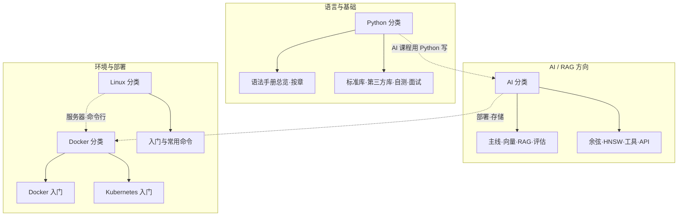

# 全站学习路径总览

本站文档分为 **Python**、**AI**、**Linux**、**Docker** 四大类。本页用一张总图 + 各分类入口与建议顺序，帮你从零串起整条学习线，按目标选路、按分类深挖。

---

## 一、全站结构总图

- **Python**：语法手册（含第11章标准库）、标准库与第三方库（课程内单篇）、自测与面试均在此分类。  
- **AI**：向量、RAG、评估、模型与 API；课程用到的标准库与第三方库在 [Python 分类](/python/) 的侧栏「标准库」「第三方库（课程内）」中，可从 [知识体系](/ai/知识体系与学习路径#四、与-python-分类的交叉) 跳转。  
- **Linux**：命令行与操作基础，跑服务、看日志、排查环境时常用。  
- **Docker**：容器与编排（含 K8s），部署 AI 服务、etcd、MinIO 等会用到。

---

## 二、按分类看：入口与建议顺序

### 2.1 Python 分类

| 目标 | 建议顺序 | 入口与文档 |
|------|----------|------------|
| 打牢语法与查漏补缺 | 语法手册总览 → 自测试卷 → 面试题 | [Python 首页](/python/) · [语法手册总览](/python/python语法手册) |
| 堆、优先队列、Top-K | heapq 使用指南 | [heapq 使用指南](/python/heapq使用指南) |
| 标准库 | 第11章总览 + math、typing、collections、random、heapq | [Python 首页](/python/)「标准库」表 |
| 第三方库（课程内） | jieba、BeautifulSoup4 | [Python 首页](/python/)「第三方库（课程内）」表 |

**分类首页**：[Python](/python/)

---

### 2.2 AI 分类

| 目标 | 建议顺序 | 入口与文档 |
|------|----------|------------|
| 从零建整体地图 | 知识体系与学习路径 | [知识体系与学习路径](/ai/知识体系与学习路径) |
| 主线：向量 → RAG → 评估 | RAG 与向量基础 → Milvus → RAG 检索增强 → RAG 评估 → RAGFlow | [AI 首页](/ai/) 课程总览表 |
| 支线：标准库与第三方库 | 第11章、math/typing/collections/random/heapq、jieba、BeautifulSoup4 | 见 [知识体系与学习路径](/ai/知识体系与学习路径) 与 [Python 交叉表](/ai/知识体系与学习路径#四、与-python-分类的交叉) |
| 向量与检索深入 | 余弦相似度、HNSW、heapq | [余弦相似度](/ai/AI课程-余弦相似度) · [HNSW](/ai/AI课程-HNSW) · [heapq 使用指南](/python/heapq使用指南) |
| 基础设施与部署 | etcd、MinIO、K8s | [etcd](/ai/AI课程-etcd) · [MinIO](/ai/AI课程-minio) · [Kubernetes 入门](/docker/Kubernetes入门) |

**分类首页**：[AI](/ai/)

---

### 2.3 Linux 分类

| 目标 | 建议顺序 | 入口与文档 |
|------|----------|------------|
| 零基础上手命令行 | Linux 入门与常用命令手册 | [Linux 入门与常用命令手册](/linux/Linux入门与常用命令手册) |

**分类首页**：[Linux](/linux/)

---

### 2.4 Docker 分类

| 目标 | 建议顺序 | 入口与文档 |
|------|----------|------------|
| 容器从零到会用 | Docker 入门与常用命令手册 | [Docker 入门与常用命令手册](/docker/Docker入门与常用命令手册) |
| 多容器编排、部署 AI/服务 | Kubernetes 入门 | [Kubernetes 入门](/docker/Kubernetes入门) |

**分类首页**：[Docker](/docker/)

---

## 三、按目标选路（我想…）

| 我想… | 建议路径 |
|--------|----------|
| 先把 Python 语法和常用库搞熟 | [Python 首页](/python/) → [语法手册总览](/python/python语法手册) → [heapq 使用指南](/python/heapq使用指南)，再按需看 [math 数学库](/python/AI课程-math数学库)、[typing 类型提示](/python/AI课程-typing类型提示)、[collections](/python/AI课程-collections) |
| 从零学 RAG / 向量 / AI 应用 | [知识体系与学习路径](/ai/知识体系与学习路径) → [RAG 与向量基础](/ai/AI课程-RAG与向量基础) → Milvus → RAG 检索增强 → 评估 → RAGFlow；需要时补 [余弦相似度](/ai/AI课程-余弦相似度)、[math 数学库](/python/AI课程-math数学库) |
| 在服务器上跑服务、用命令行 | [Linux 入门与常用命令手册](/linux/Linux入门与常用命令手册) |
| 用容器跑应用、以后上 K8s | [Docker 入门](/docker/Docker入门与常用命令手册) → [Kubernetes 入门](/docker/Kubernetes入门) |
| 部署 etcd、MinIO 或 AI 服务 | 先会 [Docker](/docker/Docker入门与常用命令手册) 与 [K8s 入门](/docker/Kubernetes入门)，再查 [etcd](/ai/AI课程-etcd)、[MinIO](/ai/AI课程-minio) 及 AI 分类里对应文档 |

---

## 四、分类间交叉关系（简要）

- **Python ↔ AI**：课程用到的标准库与第三方库均在 [Python 分类](/python/) 的侧栏「标准库」「第三方库（课程内）」；标准库总览在语法手册第11章。[知识体系与学习路径](/ai/知识体系与学习路径#四、与-python-分类的交叉) 提供从 AI 侧跳转表。  
- **Linux → Docker / 部署**：做服务器环境、看日志、排错先会一点 Linux；再学 Docker 与 K8s 部署。  
- **AI → Docker / K8s**：etcd、MinIO、RAG 服务等常部署在容器或 K8s，可先学 [Kubernetes 入门](/docker/Kubernetes入门) 再按各文档部署。

---

## 五、各分类文档清单（速查）

| 分类 | 文档数 | 入口 |
|------|--------|------|
| **Python** | 语法手册总览、语法手册按章、标准库（第11章 + math/typing/collections/random/heapq）、第三方库（jieba、BeautifulSoup4）、自测与面试 | [Python](/python/) |
| **AI** | 知识体系与学习路径、主线课程（RAG 与向量→Milvus→RAG 检索→评估→RAGFlow）、向量与检索（余弦、HNSW、ChromaDB）、工具与存储（etcd、MinIO）、模型与 API 速查 | [AI](/ai/) · [知识体系与学习路径](/ai/知识体系与学习路径) |
| **Linux** | Linux 入门与常用命令手册 | [Linux](/linux/) |
| **Docker** | Docker 入门与常用命令手册、Kubernetes 入门 | [Docker](/docker/) |

建议把本页加入书签，作为全站「总地图」使用；进入某一类后，再按该分类的首页或学习路径文档深入。
